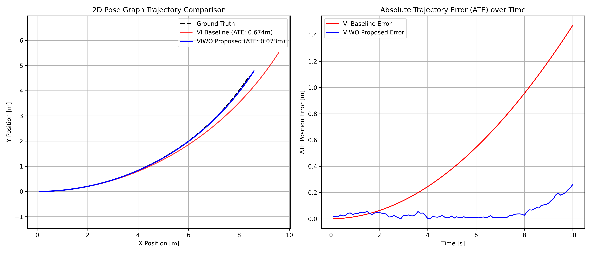

# Factor-Graph Visual-Inertial-Wheel Odometry (VI-WO) Fusion

[](https://github.com/andrealo20/viwo-factor-graph/actions/workflows/ci.yml)


[](LICENSE.txt)


**VIWO (Visual-Inertial-Wheel Odometry) Factor Graph** is a C++17 state estimation engine designed for mobile robotics. It addresses the well-known metric scale drift in monocular visual-inertial navigation by incorporating wheel encoder measurements into an incremental factor graph optimization framework.

## About The Project

Standard monocular Visual-Inertial Odometry (VIO) relies on camera frames and IMU measurements to estimate 3D motion. However, camera-based setups naturally suffer from scale drift over time, especially during constant-velocity motion or when traversing feature-sparse corridors.

This repository introduces a custom **Wheel Odometry Factor** built for the GTSAM framework. By tightly coupling relative wheel encoder measurements with visual motion and inertial priors inside a non-linear factor graph, the pipeline uses ISAM2 incremental smoothing to lock down real-world metric scale, delivering drift-resistant 3D positioning for mobile platforms.
## Benchmark Results (simulation)



| Method | Absolute Trajectory Error (ATE RMSE) | Drift Reduction |
| :--- | :--- | :--- |
| **VI Baseline** | 0.674 m | Baseline |
| **VIWO Proposed** | **0.073 m** | **~89.2%** |

These figures were regenerated against GTSAM 4.2 after fixing two invalid
`ISAM2Params` member names that had prevented the project from compiling. An
earlier version of this README quoted 0.246 m and 0.029 m; those could not be
reproduced from the published source, so they have been replaced by numbers
that can. Changing the ISAM2 relinearisation settings made no difference to
the result, so the defaults are used.

**These numbers come from a simulated trajectory, not from recorded sensor
data.** The experiment is described in full below, because the way it is
constructed determines what the figures mean: the scale drift the wheel
factor removes is drift the experiment itself introduces, from a known model
with a fixed seed. That makes the comparison exactly reproducible and isolates
the effect of adding the factor, which is what it was built for. It is not
evidence that the pipeline behaves this way on a real robot.

## Overview
Monocular Visual-Inertial Odometry (VIO) inherently suffers from metric scale drift during constant-velocity motion or visually featureless environments. This project introduces a custom **Wheel Odometry Factor** integrated into a GTSAM non-linear factor graph using ISAM2 incremental smoothing.

## Mathematical Formulation

### Custom Wheel Factor Residual
Given two consecutive $SE(3)$ keyframe poses $T_i = (R_i, \mathbf{p}_i)$ and $T_j = (R_j, \mathbf{p}_j)$, the relative body-frame displacement residual $\mathbf{r}(T_i, T_j) \in \mathbb{R}^3$ is defined as:

$$
\mathbf{r}(T_i, T_j) = R_i^T (\mathbf{p}_j - \mathbf{p}_i) - \Delta \mathbf{p}_{\text{wheel}}
$$

### Analytical Jacobians (GTSAM Local Tangent Space)

Under GTSAM local body manifold parameterisation with tangent space perturbation vector $\boldsymbol{\xi} = [\boldsymbol{\omega}^T, \mathbf{v}^T]^T \in \mathfrak{se}(3)$:

**With respect to Pose $i$** ($H_1 \in \mathbb{R}^{3 \times 6}$):

$$
H_1 = \frac{\partial \mathbf{r}}{\partial T_i} = \begin{bmatrix} (R_i^T (\mathbf{p}_j - \mathbf{p}_i))^\times & -I_{3 \times 3} \end{bmatrix}
$$

**With respect to Pose $j$** ($H_2 \in \mathbb{R}^{3 \times 6}$):

$$
H_2 = \frac{\partial \mathbf{r}}{\partial T_j} = \begin{bmatrix} \mathbf{0}_{3 \times 3} & R_i^T R_j \end{bmatrix}
$$

## How the benchmark is constructed

`src/main_benchmark.cpp` generates 100 keyframes at 10 Hz along a circular arc
of radius 10 m at 0.1 rad/s, and feeds two estimators the same measurements:

* **Visual relative motion** is taken from ground truth and then scaled by a
  factor that grows to 1.30 by the last keyframe — a deterministic 30 % metric
  scale drift, which is the failure mode the wheel factor exists to correct.
* **Wheel displacement** is the true forward speed of 1 m/s times the timestep,
  plus Gaussian noise with a standard deviation of 0.015 m.

Both estimators are identical except that the VIWO graph also receives the
wheel factor.

Three properties of this setup are worth stating plainly, because they bound
what the result shows:

1. **The wheel measurement is nearly exact.** It carries only small Gaussian
   noise, with no slip, no wheel radius error and no scale factor of its own.
   On a real platform, wheel odometry has all three, and they are the reason
   it is fused rather than trusted outright.
2. **The visual drift is deterministic and monotonic.** Real scale drift is a
   random walk driven by the observability of the scene, not a fixed ramp.
3. **Every new pose is initialised at ground truth.** `stepOptimization()`
   inserts the true pose and velocity as the linearisation point for each new
   keyframe. Both estimators get the same treatment so the comparison between
   them stays fair, but it removes the initialisation problem that a real
   system has to solve, and it flatters both trajectories.

Running the same pipeline on a public dataset — EuRoC MAV or KITTI — with real
IMU, camera and wheel streams is the natural next step and is not done here.

## Verifying the Jacobians

The analytical derivatives in `wheel_odometry_factor.hpp` are the actual
contribution of this repository, and they are the part that fails quietly: a
wrong derivative raises no error, it produces an optimiser that converges
slowly or to the wrong answer.

`tests/test_jacobians.cpp` compares them against numerical differentiation
taken under GTSAM's own retraction, over 200 random pose pairs:

```bash
cd build && ctest --output-on-failure
```

That check uses GTSAM's own retraction, which is the right comparison but
shares GTSAM's conventions with the code under test. `scripts/check_jacobians.py`
is the independent one: it reimplements the residual, the SE(3) retraction and
both derivatives from scratch in numpy, with no GTSAM involved, so a shared
misunderstanding cannot hide in both.

```bash
python3 scripts/check_jacobians.py
```

Over 200 random pose pairs it agrees with the analytical forms to a maximum
absolute error of 1.1e-09 for `H1` and 1.2e-09 for `H2`, against a threshold
of 1e-5. Negating either block, or swapping the relative rotation in `H2`,
moves the disagreement to order 1.

## Repository Structure
```text
viwo-factor-graph/
├── docs/
│   └── ate_trajectory_plot.png
├── include/
│   └── viwo/
│       ├── factor_graph_engine.hpp
│       └── wheel_odometry_factor.hpp
├── scripts/
│   └── plot_ate_trajectory.py
├── src/
│   └── main_benchmark.cpp
├── tests/
│   └── test_jacobians.cpp
├── CMakeLists.txt
├── LICENSE.txt
└── README.md
```

## Quick Start & Build

### Requirements
- C++17 Compiler
- CMake >= 3.16
- Eigen3
- GTSAM 4.0 to 4.2. Not 4.3: it replaced `boost::optional` with
  `std::optional` in the `NoiseModelFactor` interface that
  `wheel_odometry_factor.hpp` overrides. CMake checks this and stops.

```bash
mkdir build && cd build
cmake ..
make
ctest --output-on-failure      # verifies the analytical Jacobians
./viwo_benchmark
python3 ../scripts/plot_ate_trajectory.py
```
